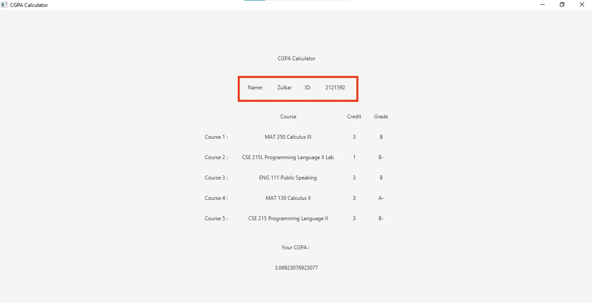
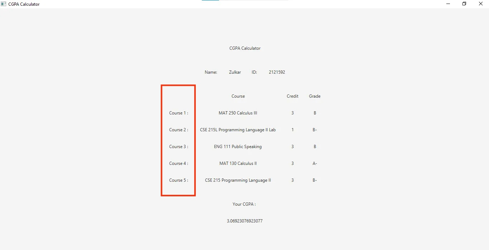
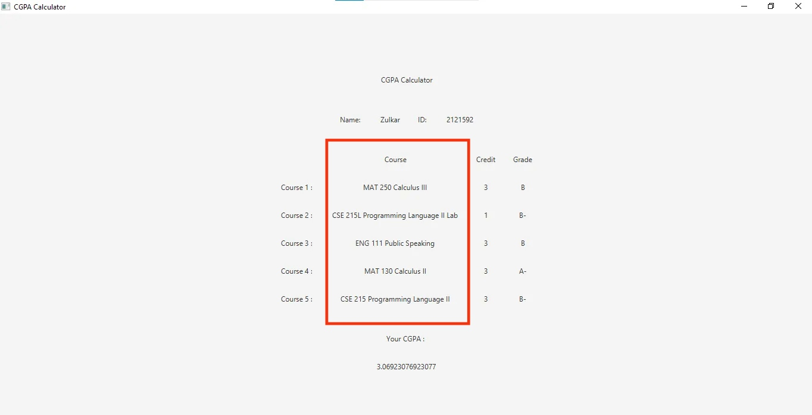
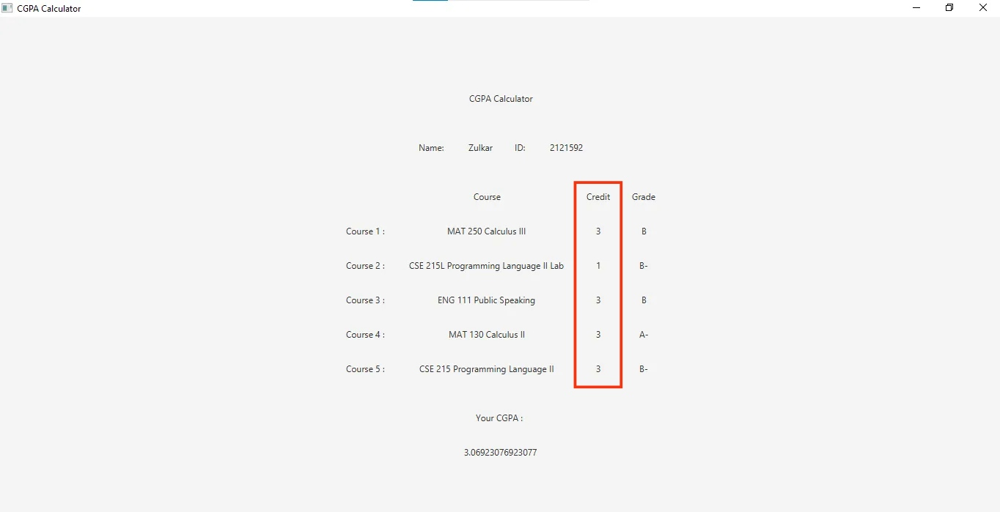
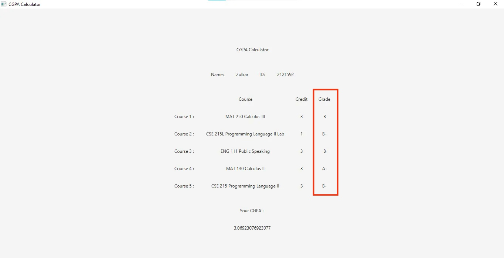
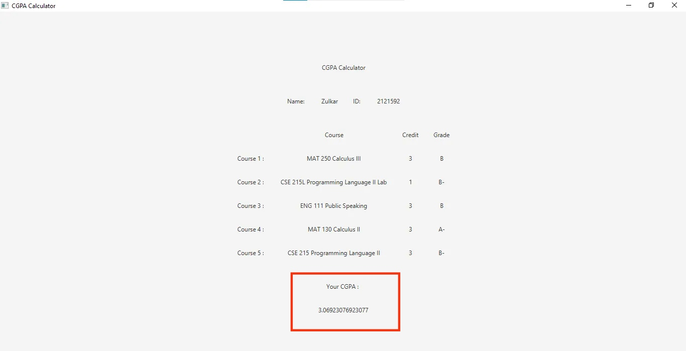
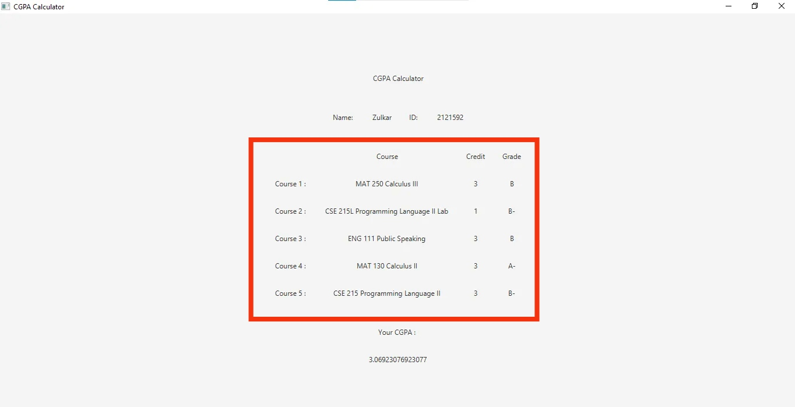
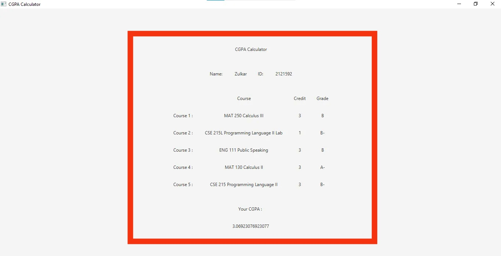

# <span style="font-family:Times New Roman; font-size:12;color:black;text-align:center">Report</span>

## <span style="font-family:Times New Roman; font-size:12;color:black;text-align:center">Second Scene</span>


<span style="font-family:Times New Roman; font-size:12;color:black">After clicking "Calculate" button, second scene will appear where calculated cgpa will be shown.</span>

```java
btnCalculate.setOnAction(new EventHandler<ActionEvent>() {
    @Override
    public void handle(ActionEvent arg0) {
        // scene_2
    }
}
```

### <span style="font-family:Times New Roman; font-size:12;color:black">Name & ID</span>
```java
String rStrName = tfName.getText().toString();
String rStrID = tfID.getText().toString();
```

<span style="font-family:Times New Roman; font-size:12;color:black">Storing "Name" & "ID" text field data to "rStrName" & "rStrID" String variables.  </span>

### <span style="font-family:Times New Roman; font-size:12;color:black">Writing u</span>ser data to a file
```java
File rFile = new File("data.txt");
try {
    rFile.createNewFile();
} catch (IOException e) {
    e.printStackTrace();
}

FileWriter rFw;
try {
    rFw = new FileWriter("data.txt");
    rFw.write("\"" + rStrName + "\" " + rStrID + "\n");

    for(int i=0; i<strInfo.length; i++){
        rFw.write("\"" + strInfo[i][0] + "\" " + strInfo[i][1] + " " + strInfo[i][2] + "\n");
    }

    rFw.close();

} catch (IOException e) {
    e.printStackTrace();
}
```

<span style="font-family:Times New Roman; font-size:12;color:black">This part writes user input data from first scene to a file "data.txt". First, a File Object called "rFile" get intialized with "data.txt" argument. Then rFile.createNewFile() will create a new file. A FileWriter Object "rFw" will write to the "data.txt" file. rFw.write() method is used for writing in a file. Above code will write name and ID in the first line. Each course name, credit, grade will be written in a new line.</span>

### <span style="font-family:Times New Roman; font-size:12;color:black">CGPA Calc</span>ulation

```java
Double[] rGPA = new Double[5];
Double rCGPA = 0.0;
Double rTotalCredit = 0.0;

for(int i=0; i<strInfo.length; i++){
    if(strInfo[i][2].equals("A")){
        rGPA[i] = 4.0;
    }else if(strInfo[i][2].equals("A-")){
        rGPA[i] = 3.7;
    }else if(strInfo[i][2].equals("B+")){
        rGPA[i] = 3.3;
    }else if(strInfo[i][2].equals("B")){
        rGPA[i] = 3.0;
    }else if(strInfo[i][2].equals("B-")){
        rGPA[i] = 2.7;
    }else if(strInfo[i][2].equals("C+")){
        rGPA[i] = 2.3;
    }else if(strInfo[i][2].equals("C")){
        rGPA[i] = 2.0;
    }else if(strInfo[i][2].equals("C-")){
        rGPA[i] = 1.7;
    }else if(strInfo[i][2].equals("D+")){
        rGPA[i] = 1.3;
    }else if(strInfo[i][2].equals("D")){
        rGPA[i] = 1.0;
    }else if(strInfo[i][2].equals("F")){
        rGPA[i] = 0.0;
    }

    rTotalCredit += Double.parseDouble(strInfo[i][1]);
    rCGPA += Double.parseDouble(strInfo[i][1]) *  rGPA[i];
}

rCGPA = rCGPA/rTotalCredit;
```

<span style="font-family:Times New Roman; font-size:12;color:black">This code snippet calculates CGPA. First we take a Double type array "rGPA" of size 5 for storing GPA for each course and two Double variable "rCGPA" and "rTotalCredit" initialized with 0.0. In a for loop GPA for each course will be determined by corresponding grades. "strInfo" is a 2D array of size 5x3. First index is for each course information and The value of the second index 0, 1, 2 indicates the name of the course, credit and grade. CPGA will be calculated with this formula: CGPA = ( Sum of every credit * corresponding gpa ) / Total Credit. </span>

### <span style="font-family:Times New Roman; font-size:12;color:black">Scene Hea</span>der Layout


```java
// ui
Label rLabelHeader = new Label("CGPA Calculator");

// layouts
HBox rHboxHeader = new HBox(HBOX_GAP, rLabelHeader);
rHboxHeader.setAlignment(Pos.CENTER);
```

<span style="font-family:Times New Roman; font-size:12;color:black">
A Label object "rLabelHeader" is initialized with text argument "CGPA Calculator". It is added to a HBox layout called rHBoxHeader with a gap between each label HBOX_GAP which is 30. "CGPA Calculator" label will be centered in the layout using setAlignment method with the argument Pos.CENTER.
</span>

### <span style="font-family:Times New Roman; font-size:12;color:black">Name & ID</span> Layout


```java
// ui
Label rLabelLabelName = new Label("Name: ");
Label rLabelValueName = new Label(rStrName);
Label rLabelLabelID = new Label("ID: ");
Label rLabelValueID = new Label(rStrID);

// layout
HBox rHboxNameIdInfo = new HBox(HBOX_GAP, rLabelLabelName, rLabelValueName, rLabelLabelID, rLabelValueID);
rHboxNameIdInfo.setAlignment(Pos.CENTER);
```
<span style="font-family:Times New Roman; font-size:12;color:black">
Two labels are created for label "Name: " and "ID: " and two labels will contain the value of user input name and id. Then all four label will be be added to a HBox layout with gap between each label HBOX_GAP which is 30. HBox layout will add name label, name, id label, id in order. All labels will be centered in the layout using setAlignment method with the argument Pos.CENTER.
</span>


### <span style="font-family:Times New Roman; font-size:12;color:black">Course Ti</span>tle Layout


```java
// ui
Label rHeaderSubject = new Label();
Label[] rSubject = new Label[5];

for(int i=0; i<strInfo.length; i++){
    rSubject[i] = new Label("Course " + (i+1) + " : ");
    // codes .....
}

// layout
VBox rVboxSubject = new VBox(VBOX_GAP, rHeaderSubject);
rVboxSubject.getChildren().addAll(rSubject);
rVboxSubject.setAlignment(Pos.CENTER);
```

<span style="font-family:Times New Roman; font-size:12;color:black">
This code snippet will create course titles. A course title header with no text is created to match credit and grade layout. A VBox layout is used with 50 px gap between each label. All titles are added in numerical order and aligned center of vertical layout.
<span>

### <span style="font-family:Times New Roman; font-size:12;color:black">Course La</span>yout


```java
//ui
Label rHeaderCourse = new Label("Course");
Label[] rCourse = new Label[5];
for(int i=0; i<strInfo.length; i++){
    // codes ...
    rCourse[i] = new Label(strInfo[i][0]);
    // codes ...
}

// layout
VBox rVboxCourse = new VBox(VBOX_GAP, rHeaderCourse);
rVboxCourse.getChildren().addAll(rCourse);
rVboxCourse.setAlignment(Pos.CENTER);
```
<span style="font-family:Times New Roman; font-size:12;color:black">
This code snippet will create course labels. A header label "Course" and 5 labels for selected course items from comboBox is created. A VBox layout is used with 50 px gap between each label. the header label and course labels are added to Vbox layout in order. Then all the elements in the layout are aligned in center.
</span>

### <span style="font-family:Times New Roman; font-size:12;color:black">Credit La</span>yout


```java
// ui
Label rHeaderCredit = new Label("Credit");
Label[] rCredit = new Label[5];

for(int i=0; i<strInfo.length; i++){
    // codes ...
    rCredit[i] = new Label(strInfo[i][1]);
    // codes ...
}

// layout
VBox rVboxCredit = new VBox(VBOX_GAP, rHeaderCredit);
rVboxCredit.getChildren().addAll(rCredit);
rVboxCredit.setAlignment(Pos.CENTER);
```
<span style="font-family:Times New Roman; font-size:12;color:black">
This code snippet will create credit labels. A header label "Credit" and 5 labels for selected credit items from comboBox is created. A VBox layout is used with 50 px gap between each label. the header label and credit labels are added to Vbox layout in order. Then all the elements in the layout are aligned in center.
</span>

### <span style="font-family:Times New Roman; font-size:12;color:black">Grade Lay</span>out


```java
// ui
Label rHeaderGrade = new Label("Grade");
Label[] rGrade = new Label[5];

for(int i=0; i<strInfo.length; i++){
    // codes ...
    rGrade[i] = new Label(strInfo[i][2]);
}

// layout
VBox rVboxGrade = new VBox(VBOX_GAP, rHeaderGrade);
rVboxGrade.getChildren().addAll(rGrade);
rVboxGrade.setAlignment(Pos.CENTER);
```

<span style="font-family:Times New Roman; font-size:12;color:black">
This code snippet will create grade labels. A header label "Grade" and 5 labels for selected course items from combobox is created. A VBox layout is used with 50 px gap between each label. the header label and grade labels are added to Vbox layout in order. Then all the elements in the layout are aligned in center.
</span>

### <span style="font-family:Times New Roman; font-size:12;color:black">CGPA Layo</span>ut


```java
// ui
Label rLabelCgpa = new Label("Your CGPA : ");
Label rValueCgpa = new Label(String.valueOf(rCGPA));

// layout
HBox rHboxLabelCgpa = new HBox(HBOX_GAP, rLabelCgpa);
rHboxLabelCgpa.setAlignment(Pos.CENTER);

HBox rHboxValueCgpa = new HBox(HBOX_GAP, rValueCgpa);
rHboxValueCgpa.setAlignment(Pos.CENTER);

VBox rVboxCgpaInfo = new VBox(VBOX_GAP, rHboxLabelCgpa, rHboxValueCgpa);
rVboxCgpaInfo.setAlignment(Pos.CENTER);
```
<span style="font-family:Times New Roman; font-size:12;color:black">
This code snippet is for CGPA. A label for "Your CGPA: " and A label for calculated CGPA is created. Two HBox layout will contain each labels and a VBox layout will contain both HBox in order.
</span>

### <span style="font-family:Times New Roman; font-size:12;color:black">Course In</span>fo Layout


```java
HBox rHboxCourseInfo = new HBox(HBOX_GAP, rVboxSubject, rVboxCourse, rVboxCredit, rVboxGrade);
rHboxCourseInfo.setAlignment(Pos.CENTER);
```
<span style="font-family:Times New Roman; font-size:12;color:black">
All the vertical column layouts will be added to a HBox layout with 30 px gap between each elements. Every elements are then aligned in center.
</span>

### <span style="font-family:Times New Roman; font-size:12;color:black">Final Lay</span>out


```java
VBox rFinalLayout = new VBox(VBOX_GAP, rHboxHeader, rHboxNameIdInfo, rHboxCourseInfo, rVboxCgpaInfo);
rFinalLayout.setAlignment(Pos.CENTER);
```
<span style="font-family:Times New Roman; font-size:12;color:black">
All the layouts that has been created so far will be added to the final layout.
</span>

### <span style="font-family:Times New Roman; font-size:12;color:black">Creating </span>Scene and adding final layout to the scene

```java
Scene scene = new Scene(rFinalLayout, SCENE_WIDTH, SCENE_HEIGHT);
```
<span style="font-family:Times New Roman; font-size:12;color:black">
A 1200x700 scene is created with the final layout.
</span>

### <span style="font-family:Times New Roman; font-size:12;color:black">Adding Sc</span>ene to Stage

```java
stage.setScene(scene);
stage.setTitle("CGPA Calculator");
stage.show();
```
<span style="font-family:Times New Roman; font-size:12;color:black">
The scene is added to the main stage. The title of the stage is set to "CGPA Calculator". stage.show() method will show the stage on the window.
</span>