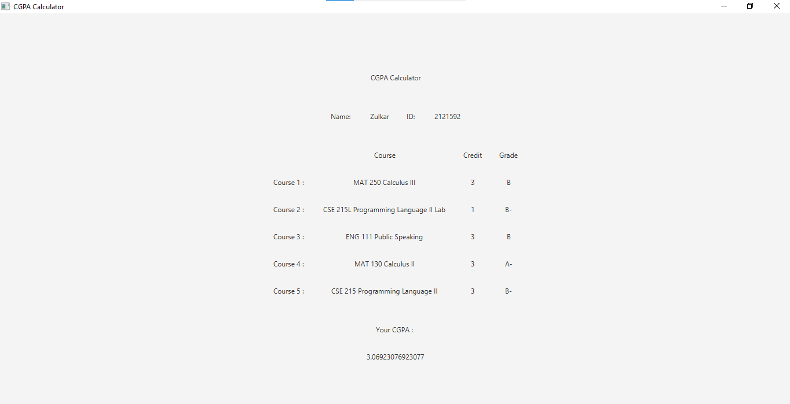
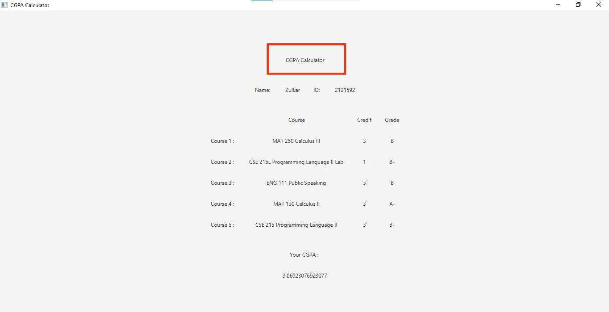

# Report

## Second Scene


After clicking "Calculate" button, second scene will appear where calculated cgpa will be shown.
```java
btnCalculate.setOnAction(new EventHandler<ActionEvent>() {
    @Override
    public void handle(ActionEvent arg0) {
        // scene_2
    }
}
```

### Name & ID
```java
String rStrName = tfName.getText().toString();
String rStrID = tfID.getText().toString();
```

### Writing user data to a file
```java
File rFile = new File("data.txt");
try {
    rFile.createNewFile();
} catch (IOException e) {
    e.printStackTrace();
}

FileWriter rFw;
try {
    rFw = new FileWriter("data.txt");
    rFw.write("\"" + rStrName + "\" " + rStrID + "\n");

    for(int i=0; i<strInfo.length; i++){
        rFw.write("\"" + strInfo[i][0] + "\" " + strInfo[i][1] + " " + strInfo[i][2] + "\n");
    }

    rFw.close();

} catch (IOException e) {
    e.printStackTrace();
}
```

### CGPA Calculation

```java
Double[] rGPA = new Double[5];
Double rCGPA = 0.0;
Double rTotalCredit = 0.0;

for(int i=0; i<strInfo.length; i++){
    if(strInfo[i][2].equals("A")){
        rGPA[i] = 4.0;
    }else if(strInfo[i][2].equals("A-")){
        rGPA[i] = 3.7;
    }else if(strInfo[i][2].equals("B+")){
        rGPA[i] = 3.3;
    }else if(strInfo[i][2].equals("B")){
        rGPA[i] = 3.0;
    }else if(strInfo[i][2].equals("B-")){
        rGPA[i] = 2.7;
    }else if(strInfo[i][2].equals("C+")){
        rGPA[i] = 2.3;
    }else if(strInfo[i][2].equals("C")){
        rGPA[i] = 2.0;
    }else if(strInfo[i][2].equals("C-")){
        rGPA[i] = 1.7;
    }else if(strInfo[i][2].equals("D+")){
        rGPA[i] = 1.3;
    }else if(strInfo[i][2].equals("D")){
        rGPA[i] = 1.0;
    }else if(strInfo[i][2].equals("F")){
        rGPA[i] = 0.0;
    }

    rTotalCredit += Double.parseDouble(strInfo[i][1]);
    rCGPA += Double.parseDouble(strInfo[i][1]) *  rGPA[i];
}

rCGPA = rCGPA/rTotalCredit;
```

### Scene Header


```java
Label rLabelHeader = new Label("CGPA Calculator");
// layouts
HBox rHboxHeader = new HBox(HBOX_GAP, rLabelHeader);
rHboxHeader.setAlignment(Pos.CENTER);
```

### 